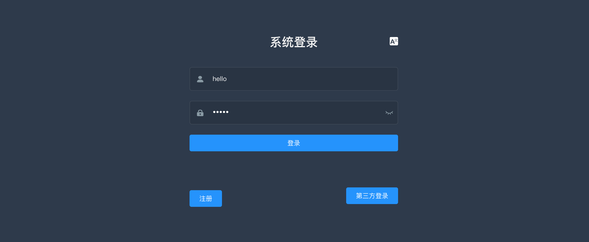
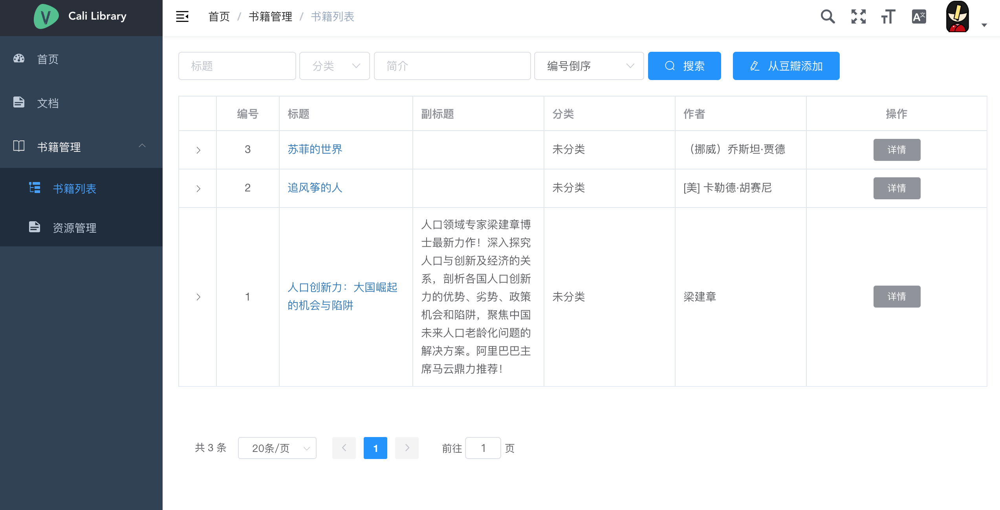
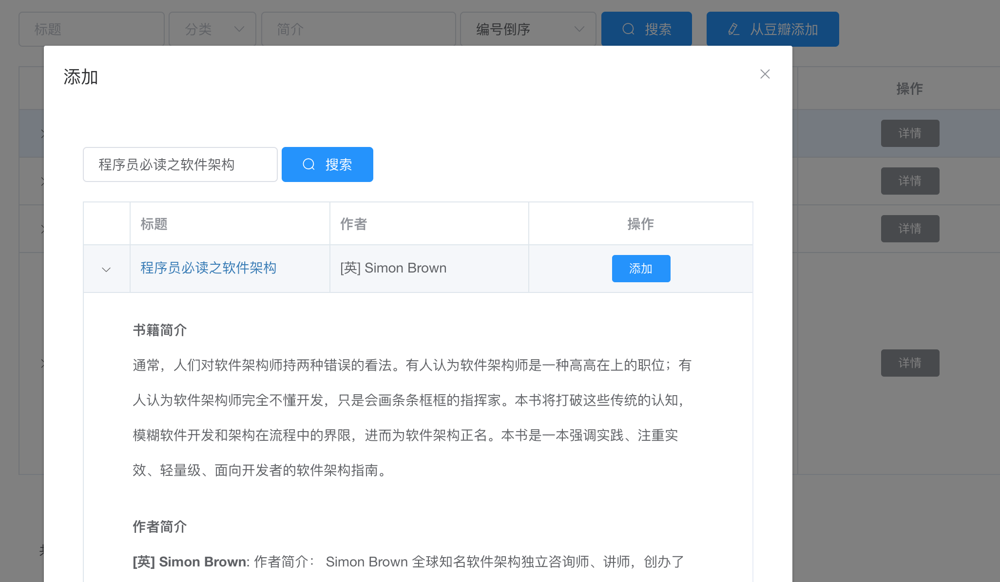
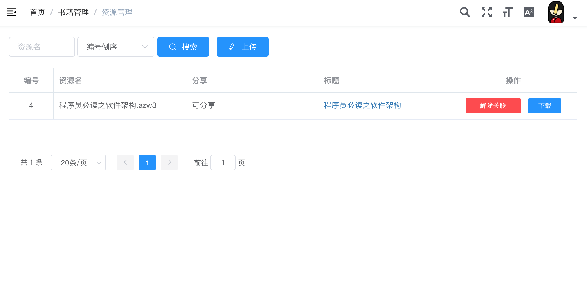
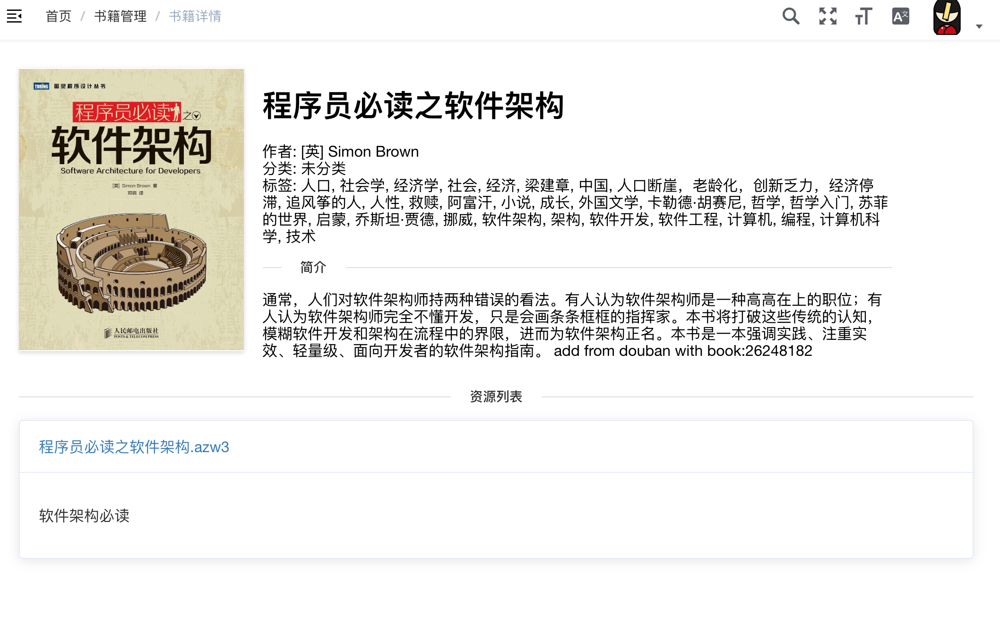

## 在线书库

在这里管理你的书籍，和大家分享阅读的喜悦。

## 使用方式

### 注册/登陆

可以使用github第三方账号登陆

### 查看书籍列表

### 从豆瓣添加书籍

### 管理你的资源

可以上传资源文件，然后绑定书籍。在绑定书籍时，可以决定是否分享给其他人。

### 查看书籍详情

在这里可以查看书籍的各种详细信息，也可以看到其他人分享的书籍，下载书籍。

## 其他说明

由于个中原因，本项目目前暂不开放代码。欢迎大家提issue!
