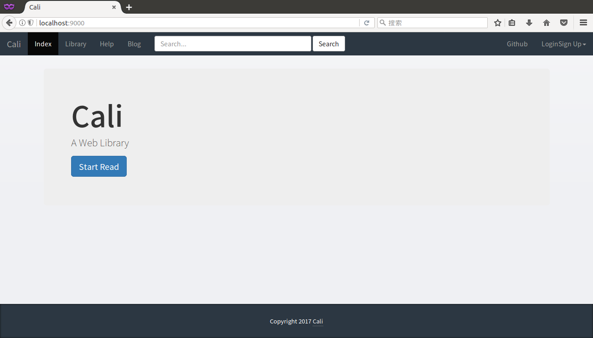

# Cali

[](https://www.travis-ci.org/jiangmitiao/cali)
[](https://github.com/jiangmitiao/cali/releases)
[](https://github.com/jiangmitiao/cali/blob/master/LICENSE)
[](https://github.com/golang/go/tree/release-branch.go1.8)
[](https://github.com/revel/revel/tree/v0.16.0)

# Welcome to Cali

[中文](https://github.com/jiangmitiao/cali/blob/master/README_CN.md)

A Web Library based on [Revel](http://revel.github.io/).

You can manage your books by [Cali](https://github.com/jiangmitial/cali).

* Add book
* List classify books
* Get book's another infomation by douban.com
* Download your favorite book
* Read book online (support epub)
* Limited user register and manage
* Search
* Delete books (planned)
* Change attribute of book (planned)
* etc...

# Usages

### Requirements

#### Get Calibre

you shoud have [calibre](https://calibre-ebook.com/) to manage your books which like *.epub,*.mobi ,.etc

then remenber your calibre library's path and the `metadata.db`.

**or**

```shell
apt-get install calibre
calibre --with-library=WITH_LIBRARY
```


### Download SourceCode or Releases

#### SourceCode

```shell
go get -u -v github.com/revel/revel
go get -u -v github.com/revel/cmd/revel
go get -u -v github.com/jiangmitiao/cali
```
#### Releases

[Releases](https://github.com/jiangmitiao/cali/releases)

### Modify Configuration

you should open `conf/app.conf`

then modify there:
```ini
books.path = your library        #/home/gavin/Calibre 书库/
books.uploadpath = /home/yourname/uploadpath/ #/home/gavin/uploadpath/
sqlitedb.path = the calibre's db #/home/gavin/Calibre 书库/metadata.db
``` 

### Start the web server:

source code:
```
revel run github.com/jiangmitiao/cali
```
or releases:
```
sh run.sh
```


### Go to http://localhost:9000/ and you'll see:



# Changelog

* **v0.0.4**
    * add monitor on download and view
    * fix register bug

* **v0.0.3**
    * search
    * fix bugs on mobile

* **v0.0.2**
    * add book function
    * read book online (support epub)
    * user register and manage function

* **v0.0.1**
    * look six'style books
    * display book's info and download link
    * display book's another info from [douban](douban.com)


# Development Environment

Gogland 1.0

