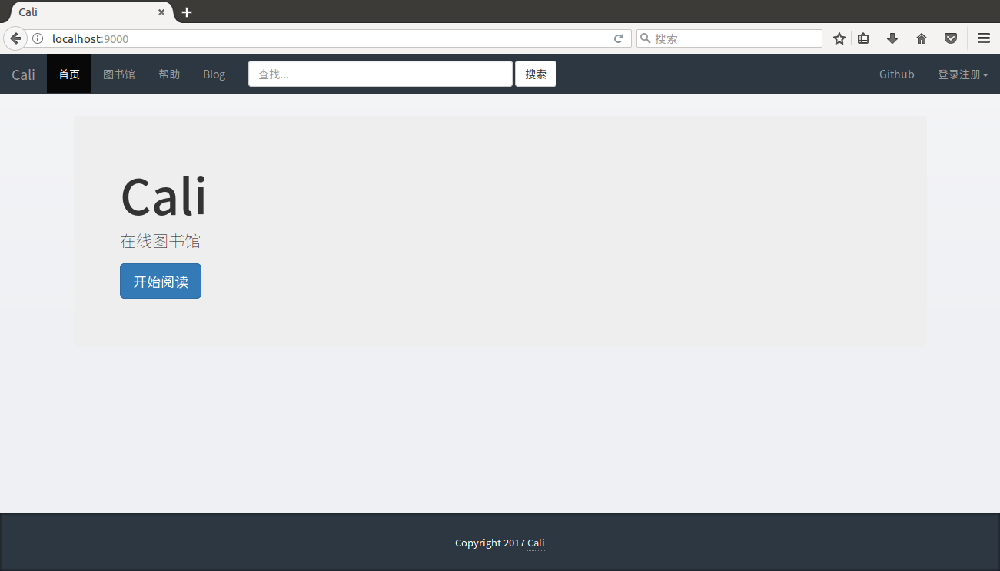

# Cali

[](https://www.travis-ci.org/jiangmitiao/cali)
[](https://github.com/jiangmitiao/cali/releases)
[](https://github.com/jiangmitiao/cali/blob/master/LICENSE)
[](https://github.com/golang/go/tree/release-branch.go1.8)
[](https://github.com/revel/revel/tree/v0.16.0)

# 欢迎来到Cali

[English](https://github.com/jiangmitiao/cali/blob/master/README.md)

这是一个基于 [Revel](http://revel.github.io/) 开发的在线图书馆.

你可以通过 [Cali](https://github.com/jiangmitial/cali) 管理你的书籍.

它的功能有:

* 添加书籍
* 根据不同的分类查看书籍
* 从 douban.com 获取更多关于查看书籍的信息
* 下载你想阅读的书籍
* 在线阅读(目前仅支持epub格式)
* 有限的用户注册和管理功能
* 删除书籍 (计划中)
* 改变书籍的信息 (计划中)
* 搜索 (计划中)
* 其他...

# 使用说明

### 安装Cali前的需求

#### 获取Calibre

你应该下载 [calibre](https://calibre-ebook.com/) 去管理你的类似epub，mobi之类的书籍

接下来，你要记住calibre创建书籍的目录和`metadata.db`的位置.

**或**

```shell
apt-get install calibre
calibre --with-library=WITH_LIBRARY
```

### 下载

#### 源码

```shell
go get -u -v github.com/revel/revel
go get -u -v github.com/revel/cmd/revel
go get -u -v github.com/jiangmitiao/cali
```
#### 发行版（linux X64）

[Releases](https://github.com/jiangmitiao/cali/releases)

### 修改配置文件

你肯定能找到这个 `conf/app.conf`

接下来，修改它:
```ini
books.path = 你的书籍目录        #/home/gavin/Calibre 书库/
books.uploadpath = 上传书籍临时存放的目录 #/home/gavin/uploadpath/
sqlitedb.path = metadata.db的全路径 #/home/gavin/Calibre 书库/metadata.db
```

### 打开程序:

源码:
```
revel run github.com/jiangmitiao/cali
```
or 发行版（linux X64）:
```
sh run.sh
```


### 在浏览器中打开 http://localhost:9000/ 你会看到:



# 修改日志

* **v0.0.2**
    * 上传书籍功能
    * 在线阅读 (目前仅支持epub)
    * 用户注册与管理

* **v0.0.1**
    * 可以以6种分类方式查看书籍
    * 展示书籍信息，下载书籍
    * 从 [douban](douban.com) 获取额外的书籍信息并展示


# 开发环境

Gogland 1.0
